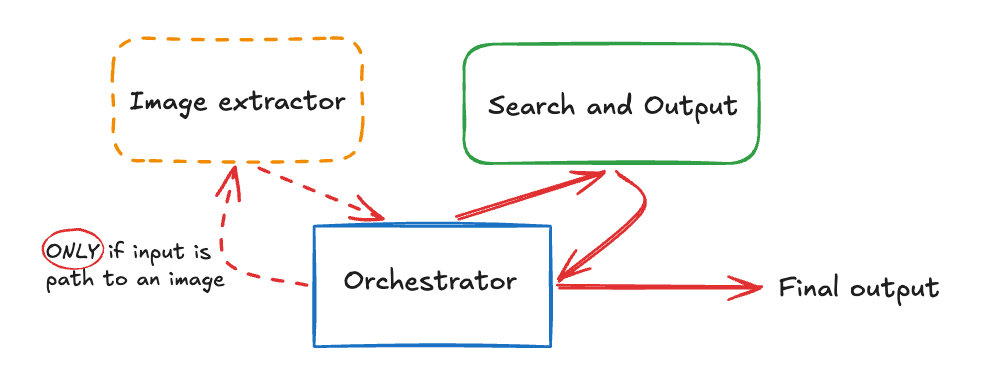

# Chef_py
A program built to find you the most suitable recipes that can be cooked up using the ingredients you have!

## Architecture and Process


The program utilizes a supervisor-worker architecture with ephemeral agents. This is implemented to help with the processing of both string and image input types.
- The orchestrator (supervisor): controls and invokes the other ephemeral agents. It's job is to determine the input type (string or image path) and make decisions based on it.
- Image extractor: receives path to an image from orchestrator and gets the image using Path. Then it performs various operations (size reduction, base64 encoding, etc.) to reduce token usage for when image is passed into its ephemeral agent. The agent is invoked and extracts a list of ingredients it finds. Returns the output to orchestrator.
- Recipe search: receives a list of ingredients and uses the time of day and the season to formulate a relevant query. Uses Tavily search to grab results and structures a response. Returns the structured recipes to orchestrator.

The orchestrator always receives the outputs of the tools it calls and decides what happens after.

## Configuration
The .env file is needed to run the program. Once made, I suggest using this template and inputting API keys for each program (exception: Langsmith is optional)
```
# --- LLM PROVIDER & CORE AGENT CONFIG ---
OPENAI_API_KEY="******"
OPENAI_MODEL_NAME="gpt-5.4"

# --- WEB SEARCH TOOLS ---
TAVILY_API_KEY="*****"

# --- OBSERVABILITY & DEBUGGING ---
LANGSMITH_TRACING="true"
LANGSMITH_ENDPOINT=https://api.smith.langchain.com
LANGSMITH_API_KEY="******"
LANGSMITH_PROJECT="chef_py"

# --- SYSTEM SETTINGS ---
PYTHONWARNINGS="ignore"
```
> Using OpenAI is not mandatory, open-weight models can also be used as long as they support multimodal.